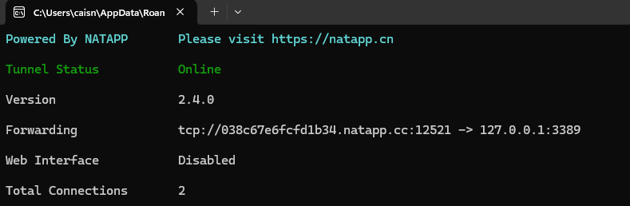
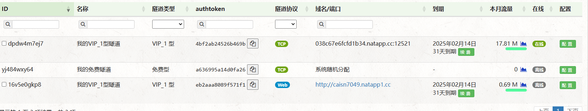
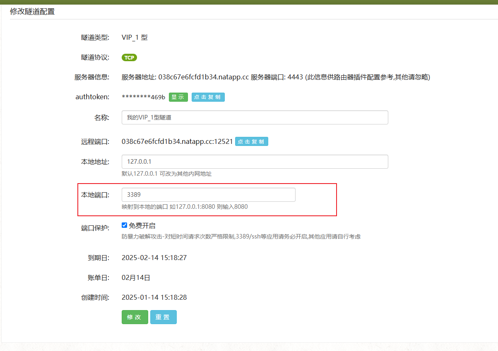
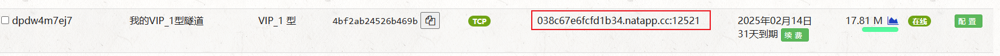
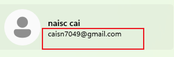

+++
date = '2025-01-14T18:05:37+08:00'
draft = true
title = 'NATAPP连接远程桌面设置'
+++
# NATAPP连接远程桌面设置
## 1. 在官网注册并下载exe
  https://natapp.cn/

## 2. 创建config.ini文件, 其中内容如下[和exe文件同一目录]:
```
#将本文件放置于natapp同级目录 程序将读取 [default] 段
#在命令行参数模式如 natapp -authtoken=xxx 等相同参数将会覆盖掉此配置
#命令行参数 -config= 可以指定任意config.ini文件
# http_proxy=                     #代理设置 如 http://10.123.10.10:3128 非代理上网用户请务必留空
[default]
authtoken=038c67efcfd1b34      #对应一条隧道的authtoken
clienttoken=                    #对应客户端的clienttoken,将会忽略authtoken,若无请留空,
log=none                        #log 日志文件,可指定本地文件, none=不做记录,stdout=直接屏幕输出 ,默认为none
loglevel=ERROR                  #日志等级 DEBUG, INFO, WARNING, ERROR 默认为 DEBUG
```

说明: 这里的authotken是隧道的authtoken, 在下载下来的exe文件正常运行起来后可以看到:


也可以在 NATAPP网页, 我的隧道中 -- > authtoken 查看:
<font color=red>!!! 这里要注意, 如果要使用telnet功能, 在购买的时候就需要选"TCP"选项 </font>


## 3. 端口映射:
在NATAPP网页, 我的隧道中, 找到自己注册的tcp的隧道, 然后点击配置:


注意要映射到本地的3389端口, 3389是默认的RDP端口

## 4.设置开机自启动:
win+r : 输入 shell:startup 打开开机启动文件夹
将exe文件和config.ini文件复制到该文件夹下, 这样每次开机就会自启动了

## 5. 连接远程桌面:
在另一台主机打开远程桌面连接:
 其中 computername 就是你在NATAPP网页中给出的ip+端口, 填入
   

   主机的填写: 打开 设置:
   

## 6.报错0x1104 等等:
报错的时候先检查本地端口映射, 主机名, 用户名是否填写正确, 以及是否有防火墙等; 排除这些之后再百度, 看下是不是remote组件配置, 防火墙允许通过应用等等问题