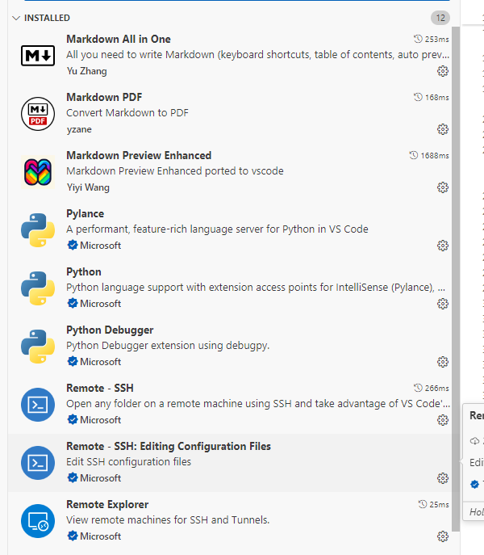

## 事项清单:
项目 | 完成进度
----- | ----
ubuntu server连接网络  - 桥接模式|  √
ubuntu配置静态ip | √
ubuntu连接vscode | √


## ubuntu server 配置网络
  #### 1. 可以ping 通物理机 但是无法ping 通www.baidu.com:
          其中物理机的网络: [control panel --> network --> network view]
          物理机: 192.168.56.1 192.168.50.1
          vmnet8: 设置了NAT模式: 192.168.14.2  -- 物理机: 192.168.14.1
          vmnet1: 设置了仅主机模式: 192.168.13.2 -- 物理机: 192.168.13.1
          还有一个默认的网关: 172.18.112.1 
参考解决办法: https://blog.csdn.net/booklijian/article/details/116491288
       在 /etc/systemd/resolved.conf文件中修改, 增加DNS信息
       并以root运行以下命令
```
systemctl restart systemd-resolved
systemctl enable systemd-resolved
 
mv /etc/resolv.conf  /etc/resolv.conf.bak
ln -s /run/systemd/resolve/resolv.conf /etc/
```

## ubuntu 设置静态ip
  设置静态ip时候经常发生错误,后面查看了,查看了下本机的route -n:
  
  <font color="#FF0000">也就是说, 172.10.112.的网关就是网桥模式的默认网关,而不是192.168.56.1和192.168.50.1之类的</font>
  
  另外子网掩码的长度也不是24,而是20
  
  

  于是最终配置完成了:
  
  ping baidu成功

  ### 附: 编辑/etc/netplan/50-....yaml文件
          编辑完之后, 输入 netplan apply应用

  ## ubuntu连接vscode
  这个比较简单, 大概记录下流程:
  * 1. 物理机下载安装最新版vscode
  * 2. vscode下载以下插件: (remote ssh)
    
  * 3.远程连接
  
  按照提示走就行

