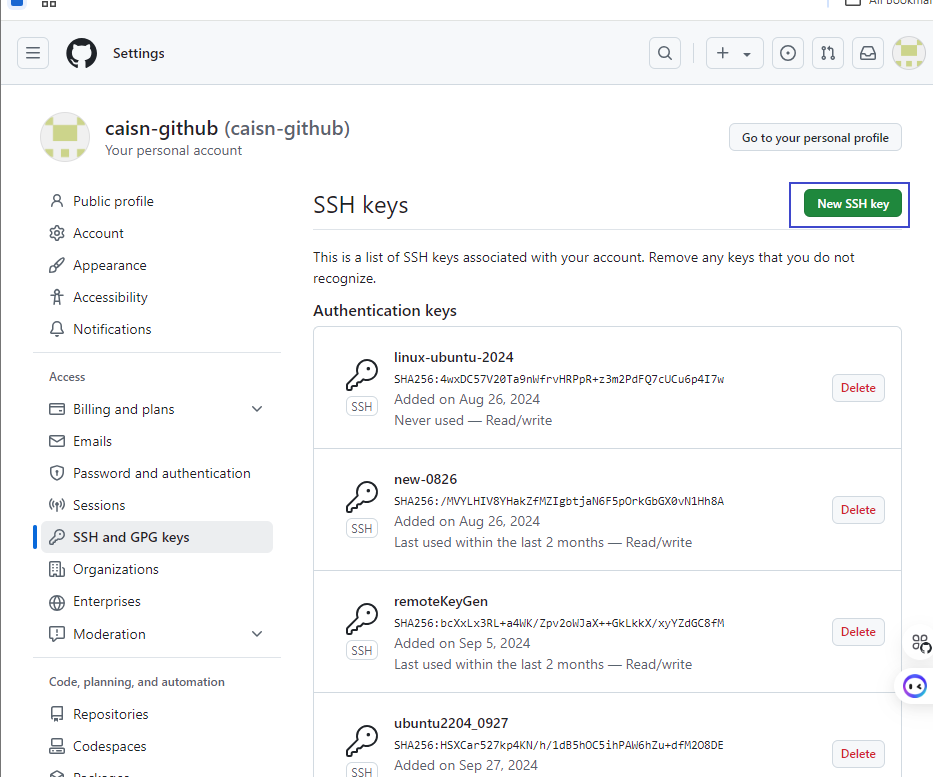

#github连接 以及 待解决问题
| 任务 | 完成进度|
----|---
ubuntu_py 的github连接 | 未完成, 遇到问题
ubuntu_server 网桥模式的网桥开启 | 改成NAT模式后重新设置ip和gateway正常连网


## github 的ssh免密码登录设置 && ssh -T 报错: connecton closed 
    背景: 准备配置ubuntu24的ssh免密登录

## 添加ssh-key步骤:
   ubuntu terminal 输入:
   ```
     sshkey-gen
     [然后直接回车,连续回车就行]

     cat ~/.ssh/*.pub
     查看本次生成的公钥
   ```
   复制到github账户下:
   
   

   点击添加New SSH key自行设置名字, 另外expire time最好设置为永久,以免失效(如果是自己的电脑的话)

## ssh -T git@github.com 报错: connection cloosed

  我寻思着以上步骤也没啥问题啊,网络也是正常的

  好的,这个问题后决定到另外一个ubuntu去尝试, 结果发现之前设置的网桥模式出错了.似乎主机或者虚拟机的网桥没有开启, 导致ubuntu_server机器出错.

## ubuntu server又又又连不上网
   感觉物理机的网桥模式可能有问题, 在此不深究了, 直接换成NAT模式去做了
   [ubuntu_server 换成nat 模式, 修改/etc/netplan文件成默认, 参照1019_2024ubuntu配置.md文档获取网关地址, 重新设置 NAT模式下的ip和gateway. -- 执行 netplan applay]
  
  
