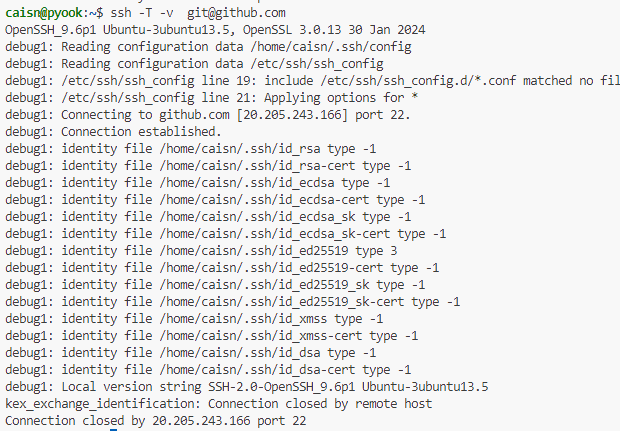
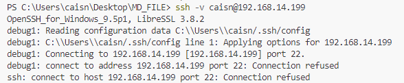
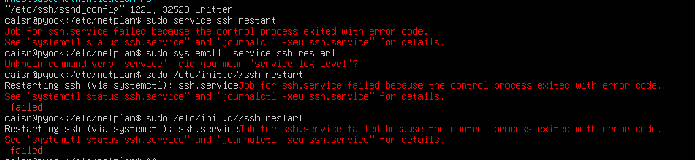
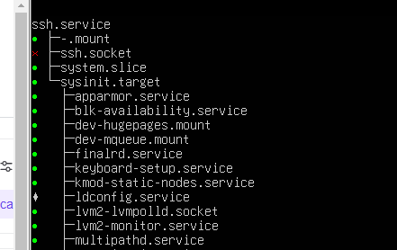
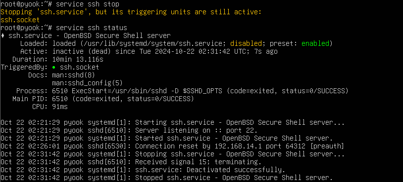
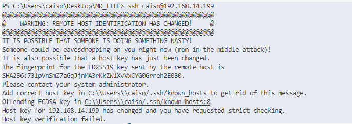
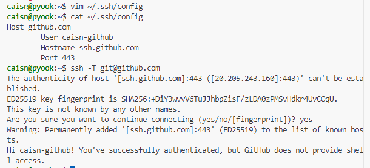
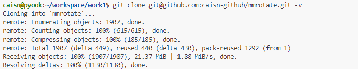

# ssh登录 kex_excahnge 以及 connetcion refused 报错 + bash 脚本解决

| 任务 | 完成进度 | 描述
---- | ---  | ---
ssh -T git@github.com报错 | √ | proxy代理错误
物理机 ssh ubuntu@ip 报错 | √ | * 依赖项缺失: ssh.socket  <br>*系统没有启动: systemctl enable ssh ; service ssh restart
ssh -T git@github.com 解决方法脚本整理 | √ | 已经上传 git@github.com:caisn-github/sn_scrpts.git
整理一份裸机添加自己github账户以及完成ssh的脚本 | x | 下次任务 

## 问题描述
出现了两个相似的问题, 问题是这样: 
1. 在虚拟机上登录ssh -T git@github.com报错
 
3. 在windows物理机上, 想要ssh 登录物理机上的ubuntu报错. 虚拟机ubuntu_server报错> connection refused. 而且这台虚拟机之前是可以登录上的???why
   其中问题2 的大概情况:
     
## 解决方法
   **问题2:** 之前是可以ssh登录上的, 但是现在不行了?????
    &emsp; &emsp; 可能是22号端口被占用了
            &emsp; &emsp;  netstat -tln | grep 22 [但是没有找到这个端口号]
    在网上看了下22号端口: 
 ```
  22号端口: 是ssh连接的默认端口. 正常情况下22号端口是要打开的
 ```
  尝试打开22号端口:

    出现新的报错: find a reseaon:
    检查ssh 依赖项:
  ```
    systemctl list-dependencies ssh.service
  ```

   
       发现ssh.socket缺失
    于是重装open-ssh service
```
sudo apt-get remove openssh-server openssh-client --purge && sudo apt-get autoremove && sudo apt-get autoclean && sudo apt-get update

sudo apt-get install openssh-server openssh-client
```

重装了之后 ssh socket可以正常跑起来了

```
启动服务以及运行:
  systemctl enable ssh
  service ssh restart 
```
**问题2.2** 物理机连接报错 - 终于是新的错误了 <.T 3


  这个解决起来比较简单, 
<font color=red>重新清理一下本地的缓存文件 : ssh-keygen -R 192.168.14.199
            重新连接服务器: ssh caisn@192.168.14.199
 
</font> 
    

**问题1:** 可能是代理服务器没有设置导致的错误?
参考链接: https://juejin.cn/post/7129443602379309086

在 ubuntu的 ~/.ssh/config文件和windows的users/caisn/.ssh.config文件中添加以下内容并重新测试


执行git clone 

成功! 

## 脚本bash scripts解决
脚本已经推到远程仓库, 之后从 
下载即可
```
#!bin/bash
if [ -f "~/.ssh/config" ] ; then
        echo "file exists, do next"
else
        touch ~/.ssh/config
        echo "touch config in ~/.ssh/"
fi
echo "Host github.com" >> ~/.ssh/config
echo "     User caisn-github" >> ~/.ssh/config
echo "     Hostname ssh.github.com" >> ~/.ssh/config
echo "     Port 443" >> ~/.ssh/config
tail ~/.ssh/config
```
执行 **<font color="blue">. github-ssh.sh </font>** 添加


