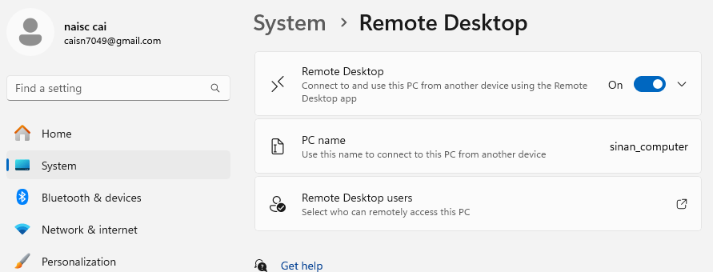
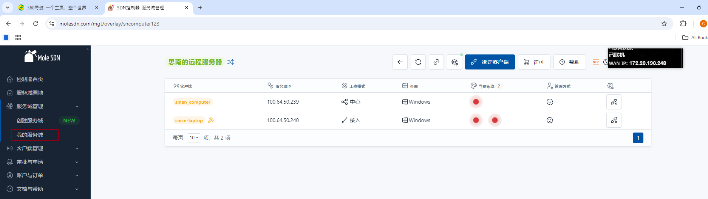

## 大概流程描述
   是这样, 为了使用windows自带的远程桌面: 但是windows自带的远程桌面是有问题的: 只能在同一个局域网下访问.
   * 1.首先到电脑设置中开启被控电脑的远程桌面权限
  
   * 2.找个工具做内网穿透, 这里用了MoleSDN来做, (没有其他原因, 鼠鼠太可爱了, 还能帮我挖洞!maye用它, 给它爆金币~!), 可以在bili上搜索教程, 直接看官网也行
   * 3.moleSDN比较简单, google搜索后, 新建我的服务器, 然后将被控电脑作为中心, 将控制端作为接入
   * 4.将被控端和控制端的鼠鼠都打开, 并连接上
   * 5.在控制端打开远程桌面, 输入上图中的"中心"的ip地址进行连接, 成功连接~!
   * 
  