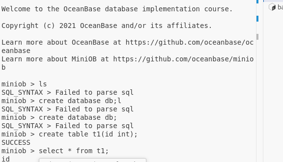

## 搭建OceanBase开发环境 -- 编译 & 运行
[已报名参加大赛]

<font color=green >参照教程:</font > 
https://oceanbase.github.io/miniob/dev-env/how_to_dev_miniob_by_vscode/#_2

https://github.com/oceanbase/miniob/blob/main/docs/docs/how_to_build.md

## 环境搭建
     已经安装的工具如下: 
```
--- 以下使用apt install即可安装, 安装之前先更行apt: sudo apt update ; sudo apt upgrade
casinan@caisinan:~/Desktop$ cmake --version
cmake version 3.28.3

casinan@caisinan:~/Desktop$ make --version
GNU Make 4.3

casinan@caisinan:~/Desktop$ g++ --version
g++ (Ubuntu 13.2.0-23ubuntu4) 13.2.0

casinan@caisinan:~/Desktop$ gcc --version
gcc (Ubuntu 13.2.0-23ubuntu4) 13.2.0

casinan@caisinan:~/Desktop$ sudo apt install googletest
[sudo] password for casinan: 
Reading package lists... Done
Building dependency tree... Done
Reading state information... Done
googletest is already the newest version (1.14.0-1).
0 upgraded, 0 newly installed, 0 to remove and 3 not upgraded.
```


其中libevent的安装方式如下:
```
wget https://github.com/libevent/libevent/releases/download/release-2.1.12-stable/libevent-2.1.12-stable.tar.gz

然后参考教程: https://blog.csdn.net/superhoner/article/details/112001995

配置安装环境:
cd libevent-2.1.11-stable 
./configure --prefix=/usr

测试是否安装成功:
ls -al /usr/local/lib | grep libevent
```
其中jsoncpp的安装方式如下:
```
参考教程 : https://blog.csdn.net/qq_52201535/article/details/133581163

安装:  
sudo apt-get install libjsoncpp-dev
sudo apt install libjson-c-dev

检查是否安装成功:
ls /usr/include/jsoncpp/json/
ls /usr/include/json-c/

*******如何使用***:
#include <jsoncpp/json/json.h>
#include <json-c/json.h>
编译: [链接库]
g++ -l jsoncpp
g++ -l ljson-c

```
flex安装: sudo apt-get install flex

bison安装参考: https://blog.csdn.net/Mculover666/article/details/118934814

## 尝试编译
      cd ./minidb
      sudo bash build.sh init
      成功执行
      bash build.sh
      成功编译

## 打包一个镜像
   用vmware直接克隆一个备份即可

## 运行oceanBase数据库
这里记录一下提交代码的网址:
       https://open.oceanbase.com/train?questionId=200001

oceanBase如何运行起来:
https://oceanbase.github.io/miniob/how_to_run/

   命令记录:
   ```
   cd home/casinan/workspace/oceanBCompertition/miniob/build
   以监听TCP端口的方式启动服务端程序:
   ./bin/observer -f ../etc/observer.ini -p 6789
   
   打开另一个终端:
   到build目录下:
   客户端连接到服务端的6789端口:
   ./bin/obclient -p 6789
   ```



好的准备提交第一笔代码 

[备注: 此文档已经提交oceanBase官网]