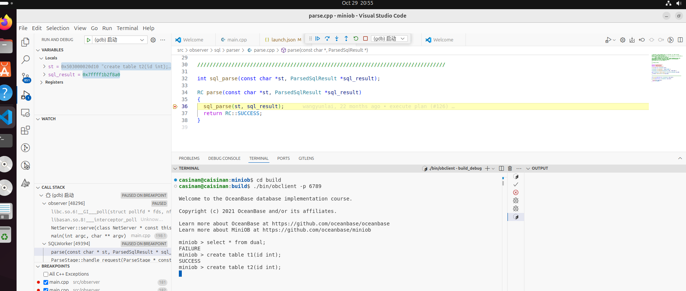

# 1029-OB环境继续搭建
## 环境继续搭建
     参考教程: https://open.oceanbase.com/train?questionId=600011

### 报错 && 解决方法:
* **报错1:**

      在安装 libaio1
      sudo apt-get install libaio1
       Reading package lists... Done
       Building dependency tree... Done
       E: Package 'libaio1' has no installation candidate
    
 解决办法: 更换apt-get源
```
这里找到了清华镜像源进行替换:
https://mirrors.tuna.tsinghua.edu.cn/help/ubuntu/
```
     目前ubuntu24.04 noble版本将sourlce.list放置到了一个新的目录下:
     /etc/apt/sources.list.d/ubuntu.sources
     cp /etc/apt/sources.list.d/ubuntu.sources /etc/apt/sources.list.d/ubuntu.sources.bak
     然后重新编辑, 将清华源加入后: 
     执行sudo apt-get update; sudo apt-get upgrade

* **报错2:**
  ```
  执行 sudo apt-get update的时候, 出现
   E: The repository 'http://archive.canonical.com lucid Release' does not have a Release file
  ```
    这里是因为 /etc/apt/source.lists.d/目录下有无法获取的源,
    找找找:
    
    把canonial的这个文件删除后重新执行命令
```
sudo rm archive_uri-http_archive_canonical_com_-noble.list
sudo apt-get update
```
* **报错3**
```
好的更换了清华源发现没卵用
我猜测 libaio1 可能是最近才出的, 或许要使用wget或者curl的方法去直接下载链接 
```
这次直接google ubuntu24 安装 libaio1 终于出现了一堆链接, 看来是找对了, let us try try: https://blog.csdn.net/engchina/article/details/139812240
```

```

### 第一次提交:
```
git checkout -b work1 origin/2024-compertition
git push origin work1:work1
```

### debug环境初步搭建完成
好累...
参考的教程:
https://oceanbase.github.io/miniob/dev-env/how_to_dev_miniob_by_vscode/--使用vscode进行开发, 这里设置了launch.josn以及tasks.json才能正常跑起来, 把服务端开起来, 然后打开客户端, 连接到数据库, debug模式已经启动了
https://oceanbase.github.io/miniob/how_to_run/


```
cd miniob/build
服务端打开:  ./bin/oberver -f ../etc/oberver.ini -p 6789
客户端打开:  ./bin/obclient -p 6789
```
