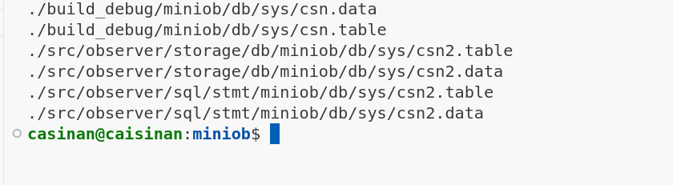

# 1030_oB_dropTable.md
## 说明:
   目前数据库已经可以成功parse drop table语句，但是 execute drop table语句时，出现了问题. 
* 问题1 : 无法启动服务器, 估计之前代码直接把sys.db都删除了, 导致无法正常启库, 解决方法: 先注销该语句, 
   ```
   感觉之前的 launch.json文件不太对劲, 也许要在 build.bin文件下执行
   ```

* 问题2 : 对于删除: 猜测drop语句要删除以下目录:
 
  这里没有加锁的情况, 估计直接删除就可以


## update功能的实现
语句: 

```
  create table t1 (id int, var int);
  insert into t1 values (1, 11);
  insert into t1 values (2, 11);
  insert into t1 values (3, 21);
  select * from t1;
  drop table t1;

  update t1 set id = 4 where id = 2;
  select * from t1;

  delet from t1 where id = 3;
  insert into t1(id) values 5;
  select * from t1;
```


测试用例: 
```
UPDATE update_table_1 SET t_name='4T61Y' WHERE id=17;
- SUCCESS
+ FAILURE
-- below are some requests executed before(partial) --
-- init data
CREATE TABLE update_table_1(id int, t_name char(20), col1 int, col2 int);
CREATE INDEX index_id on update_table_1(id);
INSERT INTO update_table_1 VALUES (17, 'JP2PK5', 72, 1);
INSERT INTO update_table_1 VALUES (97, 'R4', 47, 29);
INSERT INTO update_table_1 VALUES (36, 'TUCMM', 6, 89);

```
    