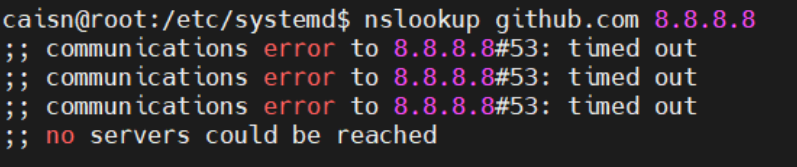
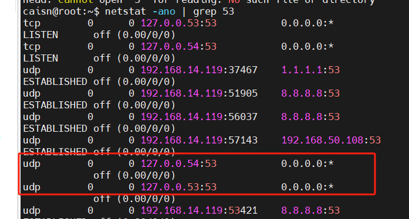
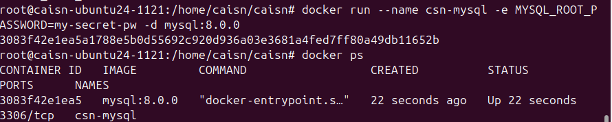
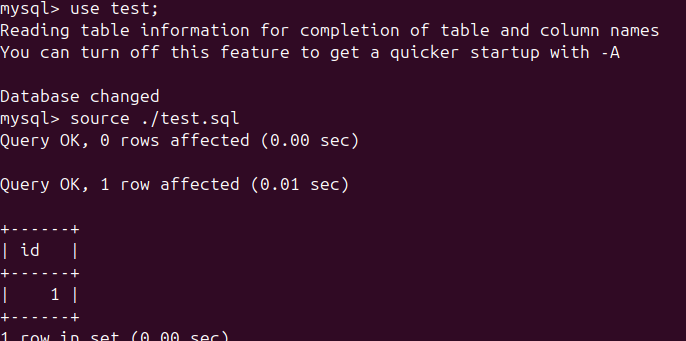
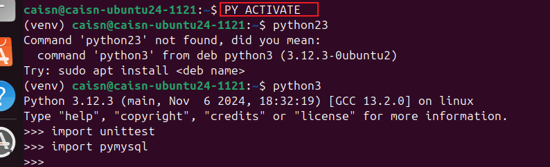
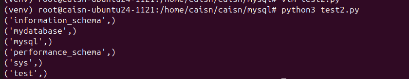

# 1121_2024安装docker-mysql -- 问题未解决
## 版本配置
由于实验需要上传mysql源码, 所以这里使用开源代码仓库已有的mysql版本
-- 在linux操作系统下载对应的 docker

操作系统版本: ubuntu24.04.1 LTS
// 登录账户记录: ssh caisn@192.168.14.119
docker版本: **mysql-8.0**
https://hub.docker.com/layers/library/mysql/8.0.0/images/sha256-228d71078f8ce5ae9fd96b183f88c3a90e30544b4b7ce9d64a238d05fef2a681
mysql源码地址: 这里有5.7, 8.0, 8.4j三个版本的数据, 为了方便,这里使用了**8.0**版本的mysql源码
https://github.com/mysql/mysql-server/tree/8.0

这里遇到一些问题: 
   报错: docker : Error response from daemon: Get https://registry-1.docker.io/v2/:net/https:request canceled while waiting for connection (Client. Timeout exceeded while awaiting headers)
解决办法: 修改为国内镜像源:

## 步骤1. 安装docker以及mysql
遇到问题: 
    无法ping通网络, 可以ping 通单个的ip地址, 但是无法ping 通域名
 
 udp的53号端口无法访问

 看了下端口占用情况:
 


尝试了几种方法,都没有找到原因, 重新装了一个ubuntu
```
开始安装docker:
参考教程 : https://www.cnblogs.com/ylz8401/p/18251415

开始安装mysql:
docker pull mysql:8.0.0

拉到镜像之后, mysql的docker使用 8.0.0 版本, 参考使用教程:
https://hub.docker.com/_/mysql

开启镜像:
注意: 要制定端口, 这样后面的 python unittest连接的时候才能正常连接
docker run -p 3306:3306 --name csn-mysql2 -e MYSQL_ROOT_PASSWORD=pw -d mysql:8.0.0

查看镜像:
docker ps

进入docker 容器: docker exec -it csn-mysql /bin/bash

进入mysql 命令行
mysql -u root -p  
密码: pw

1. 尝试直接执行sql文件":
source /path/to/your/file.sql;

   尝试直接将sql文件的输出结果输出一个文件中:
mysql -u root -p < ./test_function.sql >test_function.output


2.尝试使用python文件做单元测试:

```
### 步骤2.尝试手动直接执行sql文件



手动执行 - 尝试直接执行 sql 文件 [这里在当前目录创建了 test.sql 文件,文件内容为: 
   create  table test(id int);
   insert into test values(1);
   select * from test;
]


### 步骤3.尝试使用python文件做单元测试: 
* 注意: 由于使用的是 ubuntu24, 在按照下面的教程使用pip 安装 pymysql 的时候, 报错: 外部管理错误, 所以这里需要设置一个单独的python 环境, 创建 python venv ,这里不做展开
* 在~/.bashrc中 为当前的 pyenv 设置别名以快速启动: alias PY_ACTIVATE="source /home/caisn/.pyenv/versions/3.8.2/bin/activate"
* 这样要进入这个python环境只需要执行 : PY_ACTIVATE
  参考教程: https://blog.csdn.net/weixin_39644750/article/details/110912287


连接成功:

