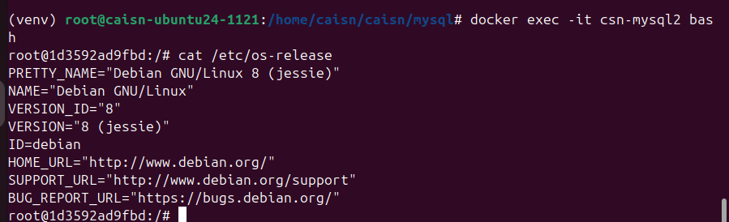
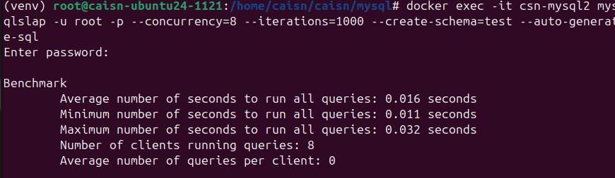
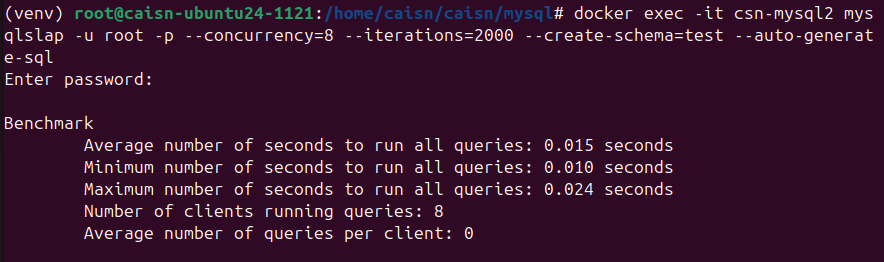
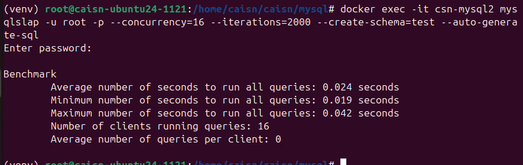
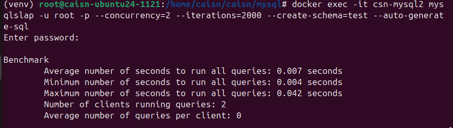

# 1123_2024 软件测试性能部分完善
## 完成软件测试期末作业:
### 代码部分:
    目前环境搭建完成
    python uniitetst 测试基本完成
    还差一个性能测试

    整理ppt, 补充完成

## 环境说明:
   测试环境:
   ```
root@1d3592ad9fbd:/# cat /etc/os-release 
PRETTY_NAME="Debian GNU/Linux 8 (jessie)"
NAME="Debian GNU/Linux"
VERSION_ID="8"
VERSION="8 (jessie)"
ID=debian
HOME_URL="http://www.debian.org/"
SUPPORT_URL="http://www.debian.org/support"
BUG_REPORT_URL="https://bugs.debian.org/
   ```


CPU 核数: 给虚拟机设置处理器为8, 每个处理器内核数量为1


### 性能测试部分:
参考教程: https://www.cnblogs.com/xulinforDB/p/17496223.html
         https://blog.csdn.net/weixin_41287260/article/details/130473382

测试环境: 使用MYSQL 自带的性能压力测试工具mysqlslap进行测试;

运行命令:
```
docker exec -it csn-mysql2 mysqlslap -u root -p --concurrency=8 --iterations=1000 --create-schema=test
Enter password: 

Benchmark
	Average number of seconds to run all queries: 0.016 seconds
	Minimum number of seconds to run all queries: 0.011 seconds
	Maximum number of seconds to run all queries: 0.032 seconds
	Number of clients running queries: 8
	Average number of queries per client: 0

```
用户数: 8
测试语句: 1000


```
docker exec -it csn-mysql2 mysqlslap -u root -p --concurrency=8 --iterations=1000 --create-schema=test --auto-generate-sql
```


测试语句设置为: 2000, 并行客户端:8



测试语句设置为2000, 并行客户端设置为:16



测试语句设置为2000, 并行客户端设置为:4  -- 这里并行书2/4是最快的, 可能数据量还不够大


测试语句设置为2000, 并行客户端设置为:2  



直接排名第一的关系型数据库oracle的数据:
[整理ppt时候附上]:


## 先整理测试用例一部分:
