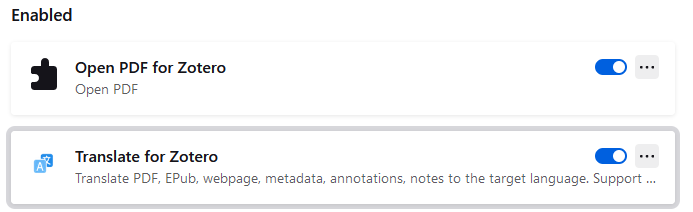
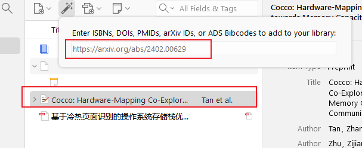

# 1125_tools_zotera使用
 ```
   准备开始认真看论文, 找了下软件, 优选zotera, 所以这里研究下zotera的使用方法
 ```

## 一. zotera导入文献
参考教程: https://www.bilibili.com/video/BV1st4y1F7FR/?spm_id_from=333.337.search-card.all.click&vd_source=d38e0f78e7b9c1eda1934361a1db49da

1. pdf导入zotera教程:
   安装以下插件
   
   其中一个是用来打开pdf文件, 另一个是用来查看英文翻译的
   之后对于下载好的pdf文件, 直接鼠标左键拖动到zotera里面就可以了

2.通过文献代码导入文件:
   打开zotera, 点击菜单栏的File->Import->Import from Citation Codes
   然后在弹出的窗口中粘贴文献代码, 点击OK即可导入文献

   直接复制网址

确实挺好用的, 还不错

3.安装浏览器-zotera插件

然后在浏览器中看到需要的文章时候, 点击浏览器 - 插件 - zotera connector, 就可以下载到本地了

大概是这个样子
看起来不错, 好用好用的

4.批量导入文献:
  这个之后再看, 先跳过 

  -- 还可以用来导入哔哩哔哩, 这个就有意思了

  知网抓取:
  同样地和3的方法相同,点击批量下载即可, 然后选择需要的文献, 点击下载即可


## 2.zotera与chatgpt的搭配使用
   参考教程: https://www.bilibili.com/video/BV1zBpUeDEzM/?spm_id_from=333.337.search-card.all.click

   参考教程: https://www.bilibili.com/video/BV1Wa4y1V777/

   chatgpt-zotera 插件:  https://github.com/MuiseDestiny/zotero-gpt?tab=readme-ov-file

   1. chatanywhere API, google申请免费内测,{[需要申请的3个数据: API, 可调用的model, 以及API key]}
    


然后回到zotera的设置里面:
就可以开始思丝滑体验了, 


ok ,开始阅读文献
2. Kimi API [要花钱], 到kimi官网申请
   
