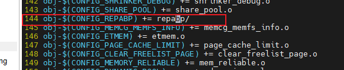
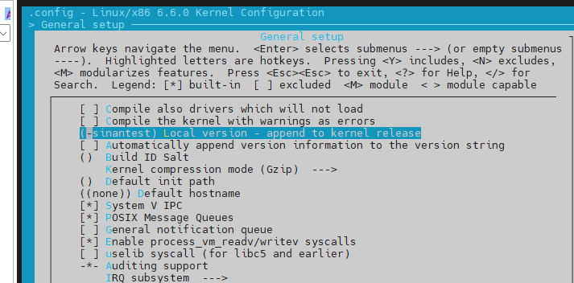
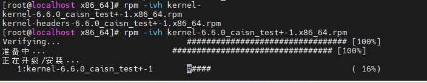
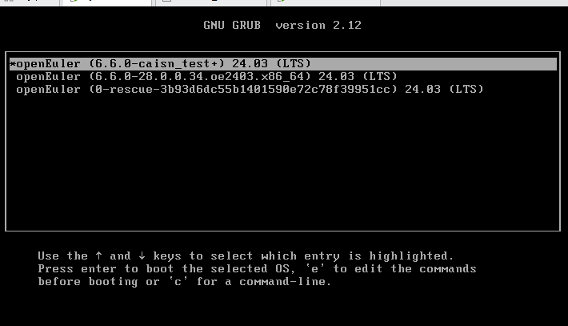
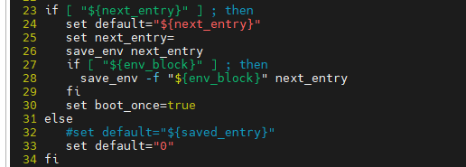

# openEuler编译openEuler
## 可参考的教程:
https://www.cnblogs.com/salty-pineapple/articles/18226917
https://forum.openeuler.org/t/topic/615


在欧拉操作系统6.6上进行下面的编译过程:

### 编译前置:
1. 拉取对应代码:
   两种方式:
   ```
   -- 这里注意分支名字
   git clone -b OLK-6.6 https://gitee.com/openeuler/kernel.git
   -- 或者这样:
   dnf install -y kernel-source 
   ```
2. 安装编译需要的工具:
   ```
   dnf install -y rpm-build openssl-devel bc rsync gcc gcc-c++ flex bison m4 elfutils-libelf-devel ncurses-devel
   ```

### 拷贝patch文件
将RePab的三份文件拷贝到kernel/patch(自己创建一个patch文件夹)

### 打补丁
```
patch -p1 <patch/RePABp.patch
```

注意这里会有几个报错, 按照rej文件进行修改
在kernel文件夹下修改如下:
mm/memory.c:


mm/Makefile:



### 编译: 
```
cd kernel/ --进入前面下载下来的kernel目录
make openeuler_defconfig -- 生成默认的.config文件
make menuconfig -- 进行配置, 选择需要编译的模块
```
注意: 在make menuconfig的时候, 可以设置下下面这里:
General setup -> Local version - 随便填入一些字, 但需要以"-"开头, 最终生成的内核名字可以在kernel/rpmbuild/RPMS/x86_64/下看到


修改.config文件:


执行编译命令:
```
make binrpm-pkg -j8
```
### 安装:
```
cd kernel/rpmbuild/RPMS/x86_64/
rpm -ivh kernel-6.6.0-1.oe1.x86_64.rpm -- 安装内核

查看安装的内核: 
rpm -qa | grep kernel
```


### 加载:
重启机器, 在进入内核选择页面的时候, 选择编译安装的内核


通过uname -r进行查看当前系统的内核版本

### 修改系统默认的启动项:
修改grub.cfg文件(/boot/grub2/grub.cfg)
(操作系统每次默认会启动最新的内核, 如果需要修改默认启动项, 可以修改grub.cfg文件)

比如这里一共有下面这个几个:


修改文件为:
[按照顺序, index从0开始, 在下面改成自己想要默认启动的数字就可以了]


最终启动效果为:

