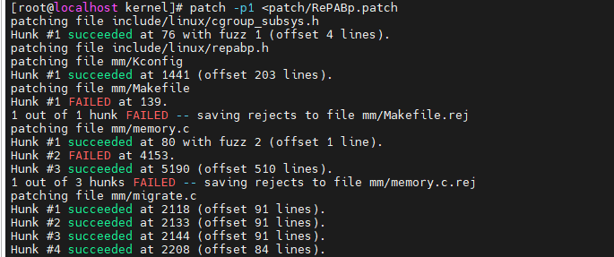

# 1219_2024_记录
| 任务 | 完成情况 | 
| --- | --- | 
| 安装欧拉系统补丁文件 | |
|手动安装arch开始 | |

## 安装欧拉系统补丁文件
补丁文件: patch文件已经放到桌面

流程: 打补丁, 重新编译, 重启系统, 然后进行验证

### 拷贝patch文件
将RePab的三份文件拷贝到kernel/patch(自己创建一个patch文件夹)

### 打补丁
```patch -p1 <patch/RePABp.patch```

注意这里会有几个报错

文件修改如下:


## 手动安装arch开始
参考教程: https://arch.icekylin.online/guide/rookie/basic-install.html
官方教程: https://wiki.archlinuxcn.org/wiki/%E5%AE%89%E8%A3%85%E6%8C%87%E5%8D%97#%E5%BC%80%E5%A7%8B%E5%AE%89%E8%A3%85%E7%B3%BB%E7%BB%9F

### 镜像文件下载地址:
https://mirrors.aliyun.com/archlinux/iso/2024.12.01/ --阿里云的
https://archlinux.org/download/#download-mirrors -- 往下滑可以看到各国的下载地址

### 签名验证:
https://gpg4win.org/index.html
windows在这里下载gpg4win并安装, 然后通过以下命令进行验证:

1. 验证签名的教程: https://www.cnblogs.com/owlin/p/13730073.html


### 待补充知识点:
 建立wsl与openEuler虚拟机之间的直接通道ssh