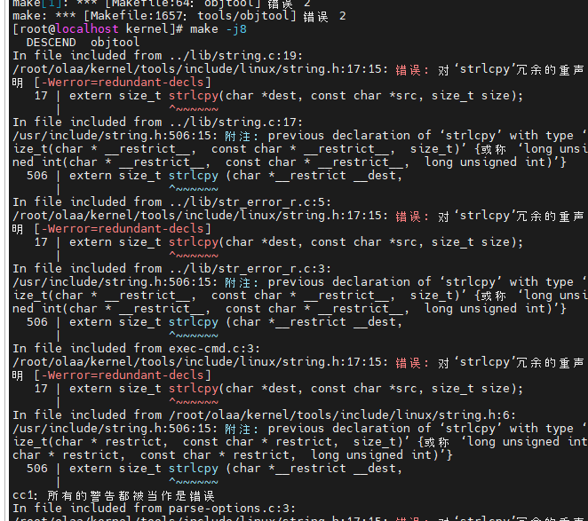
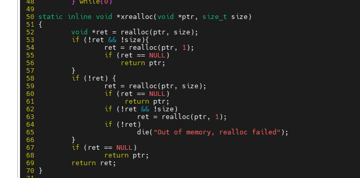
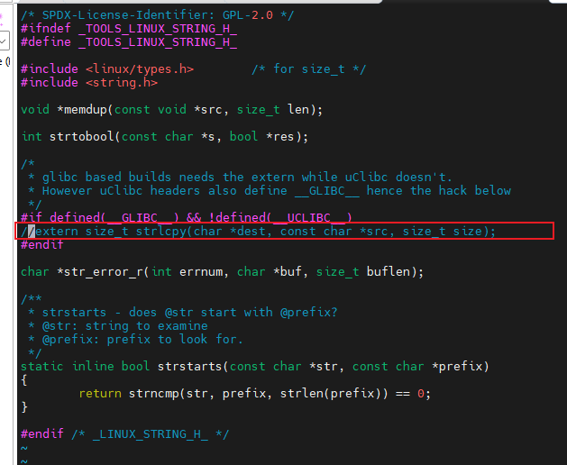

# 欧拉系统的下载与源代码编译
## 下载
参考地址: 
https://blog.csdn.net/m0_56602092/article/details/118604262

下载地址:
https://gitee.com/openeuler/kernel/releases 
https://mirrors.tuna.tsinghua.edu.cn/openeuler/kernel/releases/  

下载版本: https://gitee.com/openeuler/kernel/tree/OLK-6.6/

## 源代码编译:
参考教程:
https://www.cnblogs.com/robotech/p/16152269.html

https://blog.csdn.net/itas109/article/details/107168483

### 1. 问题1: 对'strlcpy'冗余的生命
   
 猜测是gcc版本与内核版本冲突了
    
#### 解决方案: 这里直接上手修改文件了
其中 kernel/tools/lib/subcmd/subcmd-util.h 文件修改如下:

kernerl/tools/include/linux/string.h 文件修改如下:

### 2.问题2. 没有规则用于to make target '*.pem' , needed by 'certs/certs.o'

#### 解决方案:
https://blog.csdn.net/phmatthaus/article/details/124353775
