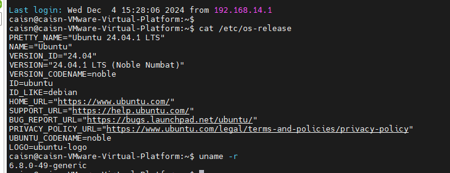
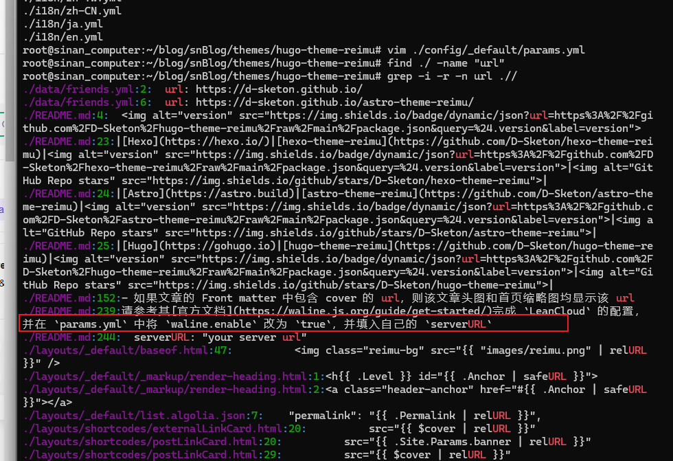
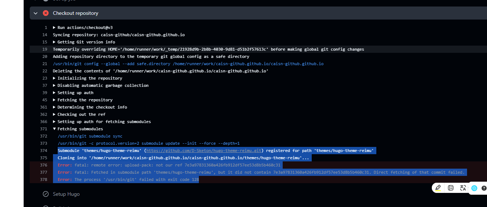
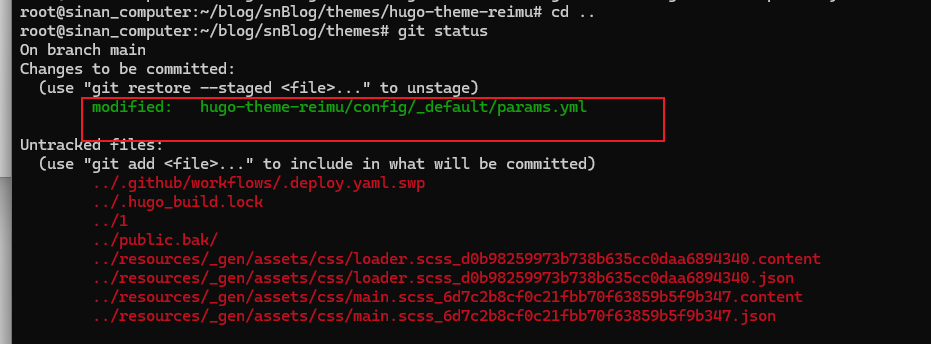

# 1204_2024任务规划以及完成情况
## 任务规划
| 序号 | 任务 | 完成情况 |
| ---- | ---- | ---- |
| 1 | 欧拉操作系统编译 | 未完成 |
| 2 | 尝试解决博客链接跳转问题 | 已完成 |
| 3 | 国奖主持人主持 | 准备中, 还差建小群, 发布公告, 以及其他工作 |
| 4 | 概率论复习 | 未完成 |
| 5 | 机器学习作业 | 未完成 |

### 下一步期待添加的计划:
| 任务 | 其他 |
| ---- | ---- |
| 认真学习linux内核编译的原理以及过程 |  |

## 欧拉操作系统
### 编译前置:
linux 版本: ubuntu 24.04 LTS 系列 
在安装的时候, 最好有30GB以上空闲, 建议磁盘空在创建的时候设置到90GB
```
复制代码
git clone -b OLK-6.6 https://gitee.com/openeuler/kernel.git
--- 注意这里一定要拉对分支, 一定要拉对分支

复制.config文件到kernel目录下
cp /boot/config-$(uname -r) .config

安装前置软件:
sudo apt install git fakeroot build-essential ncurses-dev xz-utils libssl-dev bc flex libelf-dev bison dwarves
sudo apt install zstd

```

### 欧拉操作系统编译
内核编译命令:
```
清理:
 make clean
 make mrproper
 -- make mrproper是用来清理所有编译缓存的
 make modules_clean --这个是清理模块缓存文件

 编译内核: 
 [第一次make时候出现了报错, 缺少pem文件, 这里把对应的文件在config注释掉了
  , 注释掉之后, 别执行make menuconfig, 直接执行make就可以成功编译了 
 ]
 make 

 安装内核:
 make modules_install -- 安装模块
 make install -- 安装内核
 

 更新引导配置:
 sudo update-grub

 重启系统到新内核:
 sudo reboot
 然后重启系统并选择新安装的内核即可

 在系统重启时, 检查启动日志, 通过以下方式查看:
 dmesg | grep "Hello world!"
```
### 1. 记录:

ubuntu机子上的编译

### 2.报错记录:
报错, 少了pem文件
这里直接给它注释掉了, 直接在.config文件里面注释掉了


## 搭建博客尝试: 
### 2. 尝试解决博客链接跳转问题:
   在翻阅主题的README.md文档之后, 找到了解决办法:
   修改themes/hugo-theme-reimu/config/_default/params.yml文件
   
   在这里填入相关的链接就可以了, 于是可以正常访问了

### 3. github部署的时候找不到当前的子模块: 
报错信息如下:

参考解决教程: 使用git subtree命令将子模块合并到主分支
https://daief.tech/post/git-subtree/

将原先的themes/reimu主题文件删除之后, 重新执行 git subtree add --prefix=themes/reimu https://github.com/olOwOlo/hugo-theme-reimu.git master 之后, 再做的修改就可以被主分支看到了, 大概这样子:"



