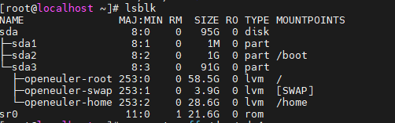
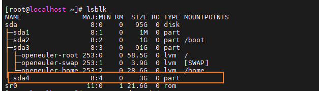
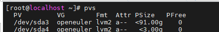
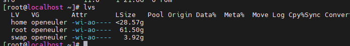
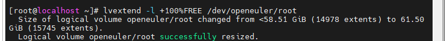

# 1204_openEuler系统扩容
## 步骤
增加物理卷
拓展卷组
拓展逻辑卷
拓展文件系统

查看块分配:
lsblk

可以看到, 此时有3GB的可用磁盘空间还没有被分配到, 此时的物理磁盘分区为sda1 - sda3

### 增加物理卷:
在VMWARE上先进行拓展

sudo fdisk /dev/sda

按n新建分区, 直接回车, 这里会默认创建 sda4 的物理卷, 最终如下所示:

创建物理卷:
--在上面已经申请了新的分区, 为sda4
sudo pvcreate /dev/sda4

查看物理卷:
sudo pvs

### 拓展卷组:
首先查看卷组:
sudo vgs

**不同的物理卷可以被划归到同一个逻辑卷的**
sudo vgextend openEuler /dev/sda4
所以这里将/dev/sda4加入到openEuler卷组中

### 拓展逻辑卷:
查看逻辑卷, 看下要挂载到哪里
sudo lvs

这里选择了挂载在root分区上, 所以选择/dev/openEuler/root
sudo lvextend -l +100%FREE /dev/openEuler/root

### 拓展文件系统:
sudo resize2fs /dev/openEuler-vg/root

查看文件系统:
sudo df -h

几个主要的步骤: 
pvs 列出所有使用的磁盘分区,.
vgs 列出所有分区组
lvs 列出所有逻辑分区
然后 pvextend
最后才是 resize2fs

### 错误记录:
#### 1.错误记录1: 使用fdisk /dev/sda 后就无法重启了, 不确定原因, 但谨慎操作