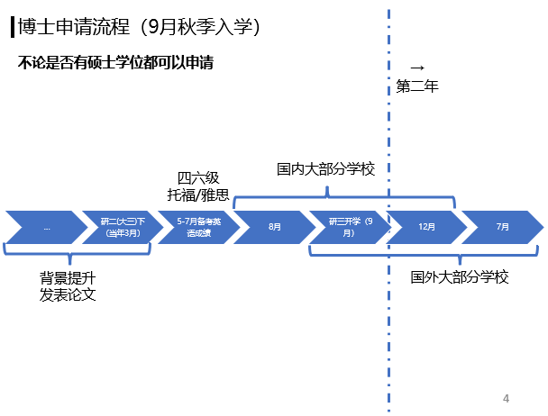

# 1205_2024国奖分享
## 工具分享
-- 杨肖迪分享
   翻译工具: DeepL翻译, 据说是最好用的翻译工具
   查找论文: Google Scholar, 免费的学术搜索引擎

-- 李禹佟分享 : 每天高效的工作三小时足矣
   英文配音工具: https://ttsmaker.cn
   PDF处理工具: https://pdfresizer.com
   语法检查工具: Grammarly(Vscode有同款插件)

-- 刘堃分享:
   文献管理工具: Zotera
   在线论文编译平台: Overleaf, 不用安装本地环境, 提供模板和Latex包, 支持多人写作和版本控制
   截图贴图软件: Snipaste

## 论文投刊选稿
-- 江佳炫分享
   投稿选刊 : LetPUB 专业SCI论文编辑
   检索:  兰州大学图书馆, 外文数据库, 以及中国计算机协会

## 专利分享
-- 张鸿瑜师兄: 尽早申请, 用于尝试

## 高效时间分享:
因为太过高效..还是贴个图把, 激励"有志之本实验室博士" - 请认真遵循~~

## 国内外博士申请流程
伍阳师兄:

-- by 司南制作
