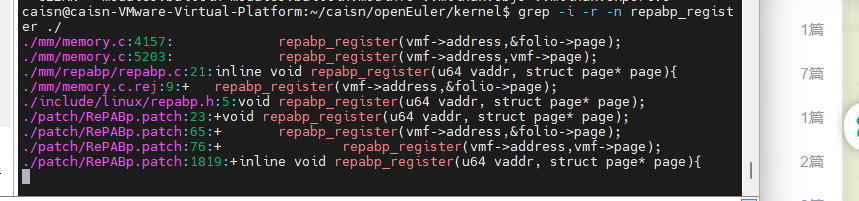

# 欧拉系统打补丁以及编译
## 日程安排:
| 计划 | 完成情况 |
| --- | --- |
| 完成Eurosys的打补丁流程以及install | 已完成 |
| 跑benchmaek | 待完成 |

https://git.dslab.lzu.edu.cn/KernelGroup/graph500 
将补丁打上去之后, 需要重新跑benchmark, 将结果跑出来

## 补丁流程:
运行patch文件:
patch -p1 < xxx.patch

对于下面两个错误记录, 这里直接找到两个报错的文件:
./mm/Makefile.rej, 以及 ./mm/memmory.c.rej 看下哪里冲突
对于Makefile.rej, 这里的解决办法是: 不需要改动

### 编译流程
对于CONFIG_REPABP的宏定义, 直接去掉, 
使用 menuconfig进行编译, 手动开启REPABP的编译选项

勾选第一个, 第二个debug的选项去掉:

这样就ok了

重新执行make

### 补丁错误记录1:

大概是下面这个样子, 在编译部分

Kconfig已经修改了, mm/memmory.c文件需要和师兄确认下

### 补丁错误记录2
编译的时候报错 undefined reference to `repabp_cgrp_subsys', 看下这个对应的函数在哪个包里被定义, 然后去找这个函数

首先去找目前已经有的定义: 
grep -i -r -n name ./

这个是因为在编译的时没有加include到 cgroup 里面去, 
在kernel\cgroup\cgroup.c里面 加上一行 ": # include <linux/repabp.h> 即可

-- 出错原因: 在链接时候没有找到正确符号, 
-- 解决方法: 首先检查再次出错的文件中能否找到目标函数的声明, 然后检查目标函数是通过哪种方式广播自己的位置: 这里有两种方式-是通过include头文件广播, 还是通过EXPORT_SYMBOL在全局符号表里广播

-- 思路总结: 
符号没有找到 --> 去找符号确定义位置 --> 检查符号所在文件repabp_cgroup.c 是否加入编译(Makefile文件) --> 看对应补丁对它做出的修改 
符号的定义位置:

可以看到是在 repabp_cgroup.c 文件中定义的, 接下来看repabp_cgroup.c文件中是否被加入到Makefile中:
,补丁之前是有加入的:
只是写的不太对, 
一开始是这么写的:

实际上补丁文件里面是这么写的:

这里的这个repabp/的意思是说加入多个需要编译的文件;
所以上述出错的本质原因就是找不到对应的函数, 解决方法有两种, 一种是在对应MakeFile中加入, 另一个是在cgroup.c文件中加入#include <linux/repabp.h> 这样就可以一起编译了.

## 其他学习:
### Kconfig和menuconfig之间有什么关系:
师兄的补丁里面修改的是
 -- 参考教程: https://blog.csdn.net/kuno_y/article/details/122574240

### 编译的过程:
内核编译时候的编译文件的顺序是怎么设定的:
1. 顶级Makefile: 位于内核源代码根目录, 负责初始化构建环境, 设置编译器, 配置选项等
2. Kbuild文件: 每个子目录下的Kbuild文件定义了该目录下源文件的编译规则和依赖关系
3. 子目录Makefile: 位于各个子目录下, 可以定义如何编译该子模块中的代码和它的依赖文件

将源代码转化为可执行文件的几个关键步骤: 预处理, 编译, 汇编, 链接
预处理: 处理源代码中的指令, 比如宏定义, 条件编译, 文件包含等, 比如#include, #define, #ifdef/#endif等
编译: 编译器将预处理后的代码转化成汇编语言
汇编: 将汇编语言转换成机器代码
链接: 将目标代码和库文件中的其他目标代码合并, 解决符号引用, 并生成最终的可执行文件 [没有链接这一步, 编译后的代码无法解析外部符号引用, 则无法形成单独可运行的程序]

[链接这一步]: 可能会涉及到一些共享库之类的

编译完之后, 在benchmark之前, 是否需要install? 

### 下一步: benchmark:
 使用graph500测试一下性能, 跑一下: https://github.com/liujunming/Tools/blob/master/Graph500%E6%95%99%E7%A8%8B.txt

