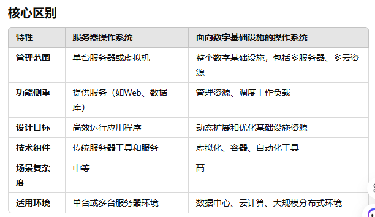
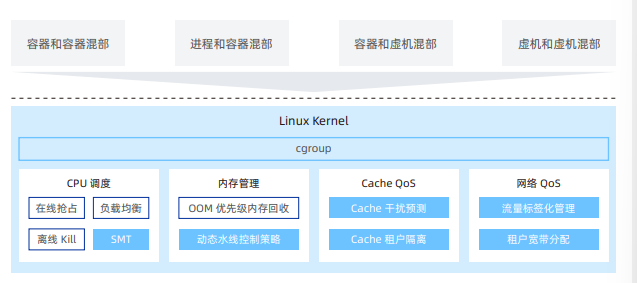

# 欧拉操作系统安装与任务明确
## 欧拉操作系统简介:
   欧拉操作系统集成了先进的linux技术, 在系统性能, 安全性, 可靠性以及容器技术等方面实现技术增强, 
优势: 见open欧拉白皮书: https://www.openeuler.org/whitepaper/openEuler-whitepaper-2203.pdf

主要特性: **从服务器操作系统正式升级为面向数字基础设施的操作系统, 支持服务器, 云计算, 边缘计算吗, 嵌入式等应用场景, 支持OT领域应用以及OT与ICT的融合**

一个小的总结:


从白皮书中, 可以看到, openEuler的5.10版本实现内核热升级内存分级扩展等多个创新特性; openEuler 21.09 增强了服务器和云计算的特性, 发布面向云原生的**业务混部CPU调度算法, 容器化操作系统KubeOS等关键技术,看同时发布边缘和嵌入式版本**


**openOLaa的新特性:**
其中与内存相关的有:
-- 大页vmalloc性能优化: 对于超过huge page的最小size的空间的空间进行vmalloc()分配的时候, 将会尝试使用huge page而不是base page来映射内存看, 改善TLB的利用看, 降低TLB miss
-- OOM 内存回收算法: 在发生OOM时, 优先对低优先级的进程组进行内存回收吗, 保障在线业务的正常运行
-- SVA支持: 进程虚拟地址在主机进程和设备间共享, 实现资源跨主机与设备免拷贝服用, 提升主机和设备业务通讯性能
-- 内存可靠性分级技术: 通过对不同可靠性等级的内存分级管理, 可以支持内核, 关键进程, 内存文件系统, 文件缓存使用高可用内存, 避免内存多bit故障引起内核复位
-- 动态大页技术: 支持对大页进行拆分和合并的功能, 从而使得绑定到memcg的进程可以使用1G/2M/4K三种页, 当大页资源不足的时候,可以动态配置大页资源, 避免系统冲求, 减少业务中断时间
-- 内存RAS容错增强:支持copy_from_user读操作时, 发生内存多bit错误, 系统不复位,. 可以通过杀掉受影响的进程, 避免内核复位,
-- 内存可靠性分级, 对用户态和服务态进行划分: 内核核心数据源高可靠, 支持进程使用高可靠, 支持文件系统使用高可靠, 支持文件缓存使用高可靠, 

-- 优化OOM时回收调度算法, 在发生OOM的时候, 优先对低优先级的进程组进行内存回收, 保障在线业务的正常运行


**Olaa的功能的基本概述:**
关于: 它的CPU调度, 内存管理机制如下:


## 在vmware安装欧拉操作系统
## 参考: 
https://www.openeuler.org/zh/download/?version=openEuler%2024.03%20LTS
https://gitee.com/openeuler/community/tree/master/zh/contributors
https://gitee.com/openeuler/community/tree/master/zh/contributors

环境安装 :https://gitee.com/openeuler/community/blob/master/zh/contributors/prepare-environment.md
https://docs.openeuler.org/zh/docs/20.03_LTS/docs/Installation/%E5%AE%89%E8%A3%85%E5%87%86%E5%A4%87.html

已经成功安装

### 下载内核进行编译:
```
git clone https://gitee.com/openeuler/kernel.git -b OLK-6.6
cd kernel
make defconfig
make menuconfig
make -j16 -- 指定几个线程进行编译
```

### dnf 常用命令整理:
```
sudo dnf install -y package_name # 安装包
sudo dnf remove -y package_name # 卸载包
sudo dnf update -y package_name # 更新包
sudo dnf update ## 更新所有包
sudo dnf search <package_name> # 搜索包
sudo dnf list installed # 列出已安装的包
sudo dnf clean all # 清理缓存
sudo dnf info <package_name> # 显示包信息
```


## make整理
对于内核开发, 首先通常先运行**make defconfig**来生成初始的.config文件, 实际在编译内核时候, 通常会执行以下命令:
```
make defconfig # 生成默认的.config文件
make menuconfig # 启动配置菜单, 进行配置
-- 这里也可以直接执行 make命令
make -j16 # 编译内核, -j16表示使用16个线程进行编译
make modules_install # 安装模块
make install # 安装内核
```