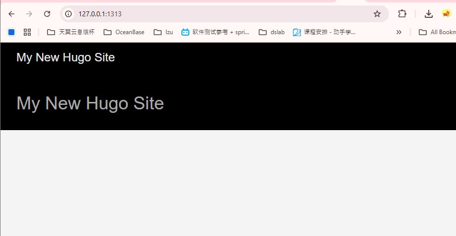
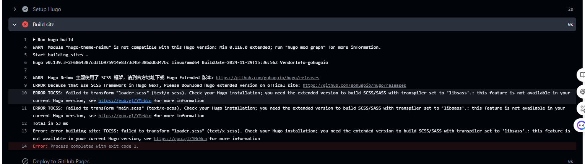
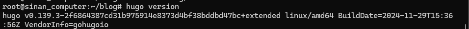
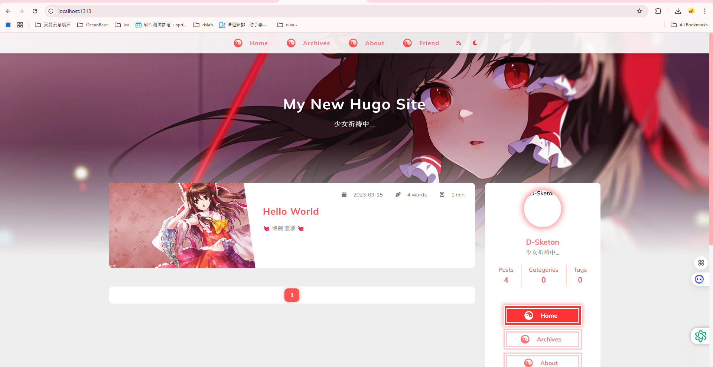
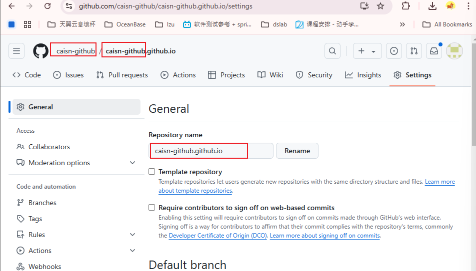

# 搭建自己的博客
## 参考zy的教程:
   https://moxianhs.github.io/posts/hugo-configuration/
   https://moxianhs.github.io/posts/github-pages-configuration/

## 建议参考的官方教程: 
  https://blowfish.page/zh-cn/docs/installation/
## 问题1, 本地运行hugo server显示空:
   
   有点奇怪, 是空的, 不知道少了什么
### 解决方法: 
   原来直接用 sudo apt install hugo 下载的hugo版本不是最新版本, 是0.93的, 首先更新到最新版本
   更新到最新版本之后就出来了: 
### 可能的原因:
   hugo/theme/config.toml文件中有一些配置项中有对hugo版本的要求,现在一般情况下要求0.100以上,所以需要下载最新版本

sudo apt怎么安装某个软件的制定版本:
<text color=red>sudo apt install package-name=version </text>
https://gohugo.io/getting-started/quick-start/


sudo apt怎么安装某个软件的制定版本:
<text color=red>sudo apt-show-versions -a  </text>

## 问题2 遇到CI报错:"版本不对, themes要求使用extended版本 但是现在是标准版本" 

在构建过程中遇到, 
这里需要重新安装hugo -extended 版本, 之前的估计不是拓展


### 原因: 
github的actions运行的默认采用标准版本, 

### 解决方法:
在本地安装hugo extended版本, 然后将本地的hugo extended版本上传到github仓库, 然后在
本地仓库- settings - Pages中选定:

从branch中进行部署, 部署的文件放在根目录的 **./.github/workflows/** 文件夹下, 
新建: deploy.yaml 文件, 内容如下:
```
name: Deploy Hugo site to GitHub Pages

on:
  push:
    branches:
      - main

jobs:
  deploy:
    runs-on: ubuntu-latest

    steps:
      - name: Checkout repository
        uses: actions/checkout@v3
        with:
          submodules: true

      - name: Setup Hugo
        uses: peaceiris/actions-hugo@v2
        with:
          hugo-version: "latest"
          extended: true

      - name: Build site
        run: hugo build

      - name: Deploy to GitHub Pages
        uses: peaceiris/actions-gh-pages@v3
        with:
          github_token: ${{ secrets.GITHUB_TOKEN }}
          publish_dir: ./public
```
将最新内容推送到github上

## 问题3 本地部署可以展示所有动态效果, 远程什么都没有
远程: 


本地:


### 原因:
如果使用其他名字命名仓库，例如mox-blog，后面部署完成之后，访问地址就变成了moxianhs.github.io/mox-blog，如果不进行额外的配置，所有的 css、js、亦或是资源文件，都将找不到正确路径。

### 解决办法:
仓库 - settings -general - repository name 修改为 github-name.github.io, 如下所示


## 问题4: 本地可以点开放进去的md文件, 远程不行
远程只能看到标题, 点进去直接报错